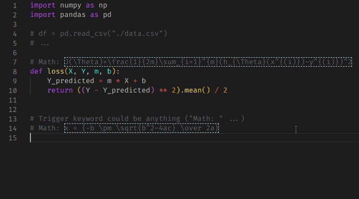

# Mathover

[](https://github.com/yousefvand/mathover/releases) [](https://github.com/yousefvand/mathover/issues) [](http://isitmaintained.com/project/yousefvand/mathover "Average time to resolve an issue") [](https://github.com/yousefvand/mathover/network) [](https://github.com/yousefvand/mathover/stargazers) [](https://github.com/yousefvand/mathover/blob/master/LICENSE)

A [vscode](https://code.visualstudio.com/) extension to preview math formulas in comments.

- Works in any document (default: configured for Python).
- Supports Latex, MathML in either inline or display mode (default: display).
- Works offline.
- Caches images.
- Highly configurable.

## How to use

Define a trigger pattern as `regex` by setting `matchRegex` and `matchRegexFlags` in extension configurations.

Default pattern looks for `# Math: ` and interprets whatever after it as **math** to the end of the line.



## Installing from source

You need to have [git](https://git-scm.com/) and [node.js](https://nodejs.org/) installed. Go to your vscode extension path:

- Windows `%USERPROFILE%\.vscode\extensions`
- macOS `~/.vscode/extensions`
- Linux `~/.vscode/extensions` (OSS: `~/.vscode-oss/extensions`)

Make sure extension is not already there (`remisa.mathover-{version}`). Close vscode before running following commands:

```bash
# Assuming current path is: ~/.vscode/extensions
git clone https://github.com/yousefvand/mathover.git
cd mathover
npm i
npm run compile
```

Open vscode and extension is installed (see [#1](https://github.com/yousefvand/mathover/issues/1)).

### [Change History](CHANGELOG.md)
